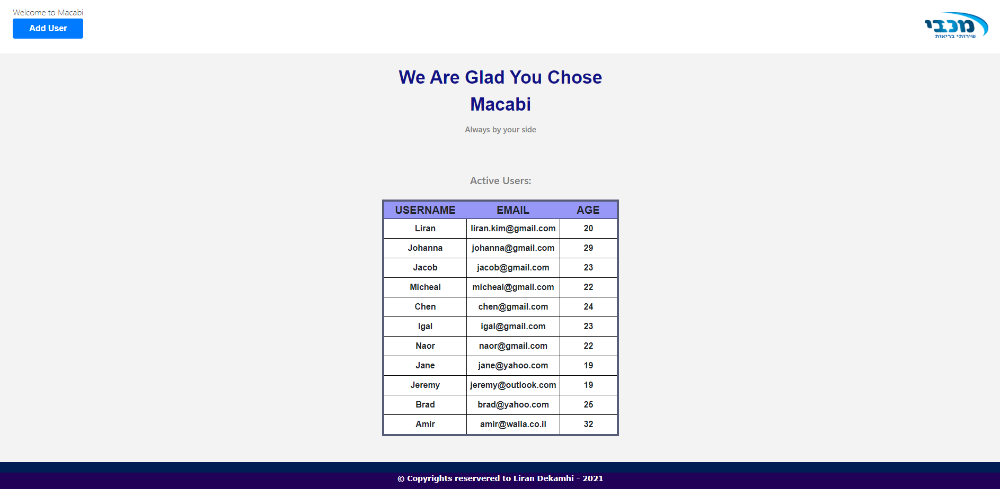
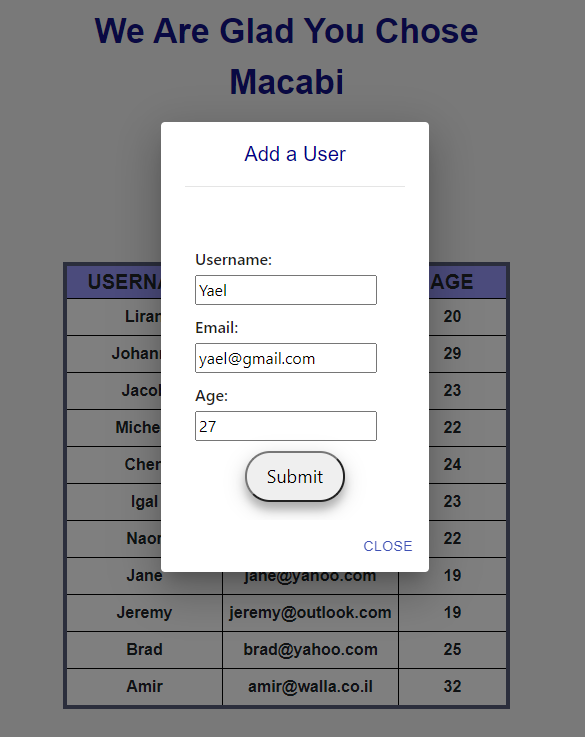
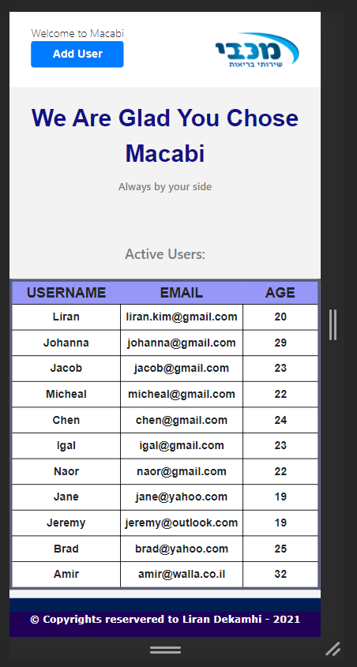
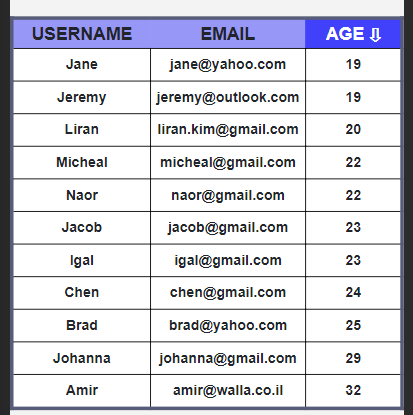

# User Registration

Responsive SPA for registering users and also viewing them.

## Topics:

* HTML + CSS
  - HTML5 Structure
  - Bootstrap design
  
* ReactJS
  - Redux
  - Reducer
  - Actions
  - Axios
 
* Material-UI

* NodeJS
  - Using Express
  - Restfull App
  
* MySQL
  - Design & create schema
  - Queries

***

# For better user experience:

Instead of having multiple screens, one for adding a new user
and one for viewing all of the existing users,
I chose to display right away all of the users on one screen
and I included a button in the header component which opens a modal
/ Resonsive Dialog that has a form for adding a new user.
Upon adding a user via the opened modal, the user will also be automatically
added to the table with all of the existing users.

## Username and Email must be unique

Usually when you register to a new site, you must provide unique username and email address,
Hence the decision to make them both unique.

### Main Page:

### Modal:

### Responsive Design:

### Talbe Sorting - Ascending / Descending:

